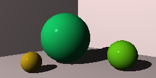
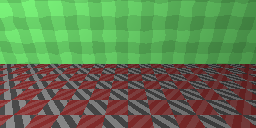
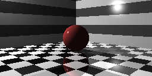
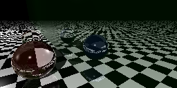
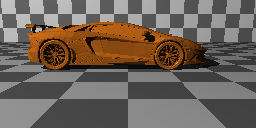
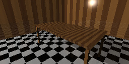
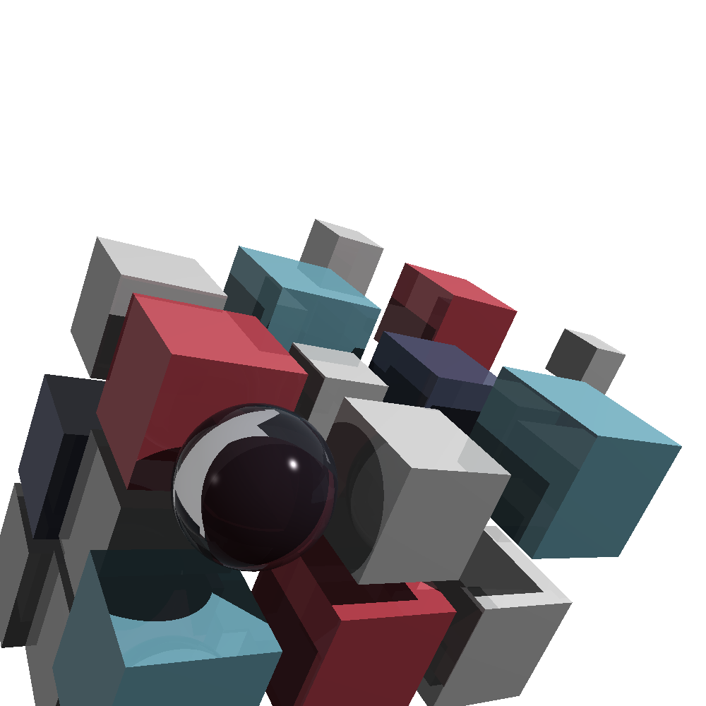

# Ray Tracer Challenge (C++)

This project is a C++ implementation of *The Ray Tracer Challenge* by Jamis Buck. It builds a ray tracer from scratch,
supporting features such as ray-object intersections, shading, reflections, transformations and Constructive Solid Geometry (CSG)

---

## Features

- Ray intersections with several primitive shapes
- Phong lighting model (ambient, diffuse, specular)
- Shadows
- Reflections And Refraction
- Transformations (translate, scale, rotate, skew)
- Groups
- Bounding Boxes
- Constructive Solid Geometry (CSG)
- Simple OBJ file parsing
- PPM image output

---

## Notes

- Recursion has been limited to a depth of 5
- Optimization via bounding groups where applicable

---

## Examples

### Shadows

### Nested Patterns

### Reflection

### Refraction

### Obj Parsing

### Scene Of Cubes

### Cover Image

---

## Credits

- Nicholas Solomon, 2026
- Based on *The Ray Tracer Challenge* by Jamis Buck
- Implemented in modern C++ (C++23)

---